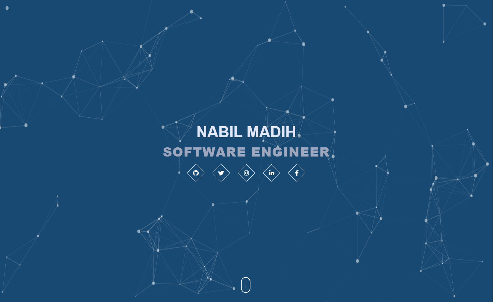

## Old Portfolio Website

My First portfolio website created using Javascript HTML and CSS. 
I Also used multiple libraries for example [Particle.js](https://github.com/VincentGarreau/particles.js/) that gave the very cool particle effect in the header.

I have Learned a lot making this website, and will forever be my first love haha.

It is not by any means perfect, but it was a start. 

### My new Portfolio Website

I have since gotten considerably better at developing websites, and you can find my new portfolio website here [V2_Portfolio](https://nabilmadih.com/) .

